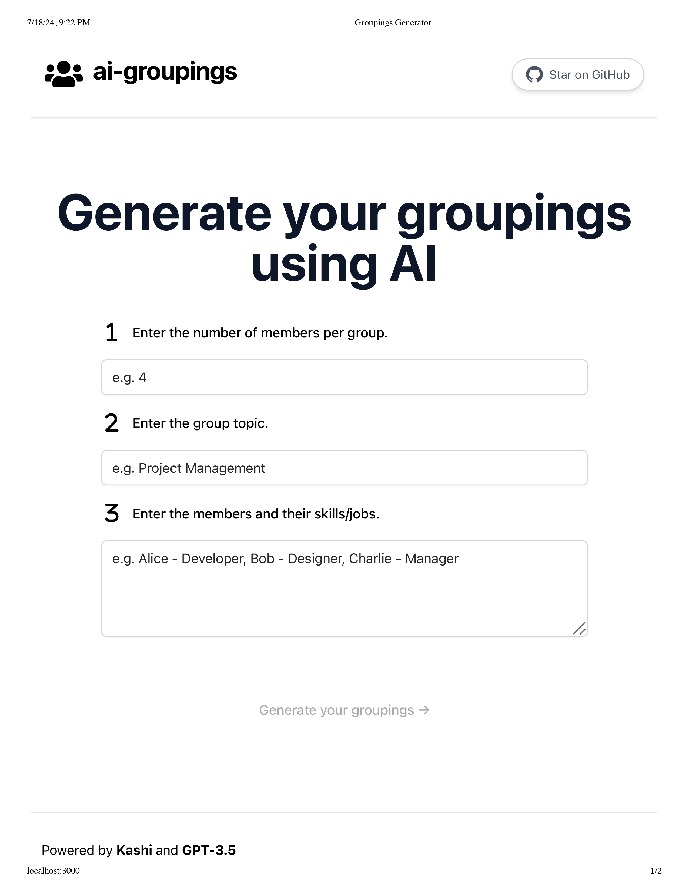

# [twitterbio.io](https://www.twitterbio.io/)

This project generates AI-Evaluated Groupings.

## How it works
Generate dynamic groupings using AI, specifying the number of members per group, the group topic, and member details including their skills or jobs.

## Features
- Input the number of members per group.
- Specify the topic for the group.
- Add members with their respective skills or job titles.
- Generate groups dynamically using AI.
- Copy generated groupings to clipboard with a single click.